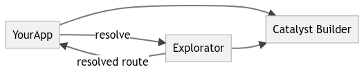
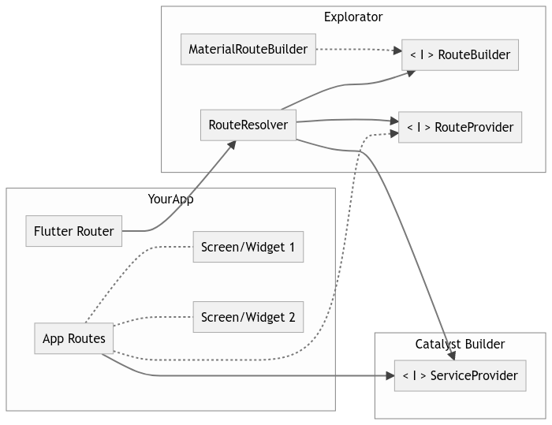
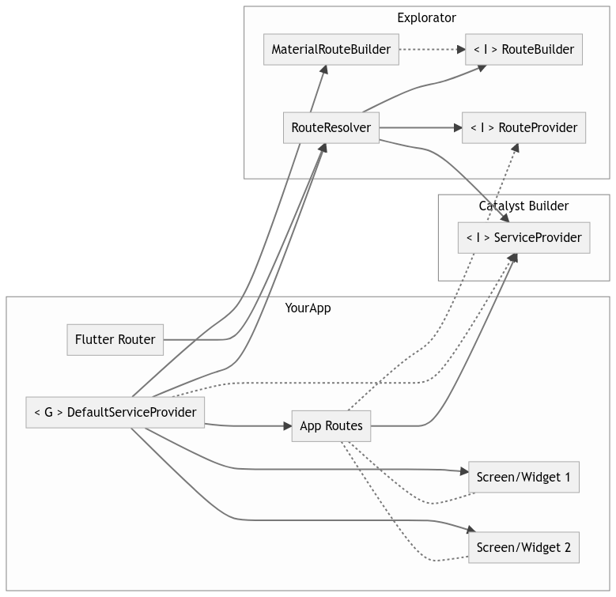

# Under the hood

## Level 0 - Top view
At the top view, the App is organized like this.
You require `explorator` and `catalyst_builder`. `explorator` requires `catalyst_builder` too.




## Level 1 - Inner communication
Legend:
- `< G >` = Generated Code
- `< I >` = Interfaces
- `Dashed with arrow head` = Implementation
- `Dashed without arrow head` = Type dependency

The simplified Version of this level looks like this:


As you can see, your app only needs to know about the `RouteResolver` and the `RouteProvider` interface.
The RouteResolver is used in `MaterialApp.onGenerateRoute`, the RouteProvider is implemented in our class that provide
the routes.

That view seems a bit incomplete, let's take a look on the full version with generated code.



Let's take a look on the connection between `App Routes` and `Screen/Widget n` / `RouteProvider`.
The `App Routes` class implements the `RouteProvider` interface. That means, that we have to implement the `routes` 
property which returns a list of [`RegisteredRoute`](../lib/src/registered_route.dart). 
For each route you need to define a path and a builder. The interesting part about this is the builder.
The `builder` is just a method that accepts an instance of a catalyst `ServiceProvider` and returns a default 
`WidgetBuilder` function.
That means, we can use the given provider to resolve our `Screen/Widget n` without constructing it manually. 
Since the `App Routes` class is not imported anywhere (ignore generated code 😉), the coupling is not worth mentioning.

As you noted, there is a connection between `ServiceContainer` and `App Routes`. That means, that the 
`App Routes` class must be decorated with `@Service(tags: [RouteProvider.tag])`.

-----

Next step: take a look on the connection between `RouteResolver` and `RouteProvider` / `ServiceContainer`.

The [`RouteResolver`](../lib/src/route_resolver.dart) expects in the constructor a `List<RouteProvider>`. If you take
a look in the code, you can see, that the constructor parameter is decorated with `@Inject(tag: RouteProvider.tag)`.

Now you can put two and two together. The `ServiceContainer` takes all services that are tagged with `RouteProvider.tag`, 
including our `App Routes` class, and inject it as a list to the `RouteResolver`.

-----

That's already most of the magic. Let's take a look how routes are resolved.

Since the `RouteResolver` is decorated with `@Service`, the `ServiceContainer` can construct this class.

And that's exactly what happens in this piece of code. 
```dart
Widget build(BuildContext context) {
  return MaterialApp(
    // 1. We resolve the `RouteResolver` from the Container
    // 2. Tell the Flutter router "use `resolveRoute` to generate routes"
    onGenerateRoute: _container.resolve<RouteResolver>().resolveRoute,
  );
}
```

The `RouteResolver.resolveRoute` looks more complicated as it's.
1. It accepts a `RouteSettings` object, that contains a `name` (=path) and `arguments`
2. The `name` is the `path` of our `RegisteredRoute`. 
   - The `RegisteredRoute` creates a Regex from this path.
3. Then it iterates over all `RegisteredRoute`s (passed in the constructor) and check if the `name` match against the regex.
4. If it's a match, the method extracts the path variables and creates a sub-`ServiceContainer`.
   - The sub-`ServiceContainer` contains additional services:
     - [`RouteArguments`](../lib/src/route_arguments.dart)
     - `RouteSettings`
5. Using the builder from the `RegisteredRoute` to construct the widget. We pass the sub-`ServiceContainer` as the `ServiceContainer`.
6. Using the `RouteBuilder` to construct and return a Flutter route.

Not that complicated, right? 😅